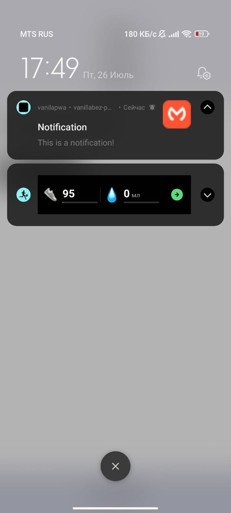

# PWA с Push Notifications

Этот проект демонстрирует, как превратить обычный сайт в PWA (Progressive Web App) и добавить push notifications.

## Содержание

1. [Установка](#установка)
2. [Файлы проекта](#файлы-проекта)
    - [index.html](#indexhtml)
    - [sw.js](#swjs)
    - [manifest.json](#manifestjson)
3. [Запуск](#запуск)
4. [Использование](#использование)

## Установка

1. Склонируйте репозиторий или загрузите архив с файлами проекта.
2. Разместите файлы на вашем сервере.
## Файлы проекта

### index.html
```html
<!doctype html>
<html lang="en">
<head>
    <meta charset="UTF-8">
    <meta name="viewport" content="width=device-width, initial-scale=1.0">
    <link rel="manifest" href="manifest.json">

    <script>
       // Здесь проверяется, поддерживается ли Service Worker в браузере. 
       // Если поддерживается, происходит регистрация sw.js — файла Service Worker.
        if ('serviceWorker' in navigator) {
            navigator.serviceWorker.register('sw.js')
                .then(function(registration) {
                    console.log('Service Worker registered with scope:', registration.scope);

                    // После успешной регистрации Service Worker запрашивается разрешение 
                   // на показ уведомлений. Если разрешение получено (permission === 'granted'), 
                   // вызывается функция subscribeUserToPush, которая отвечает за подписку 
                   // пользователя на push-уведомления.
                    Notification.requestPermission()
                        .then(function(permission) {
                            if (permission === 'granted') {
                                console.log('Notification permission granted.');
                                subscribeUserToPush();
                            } else {
                                console.error('Unable to get permission to notify.');
                            }
                        })
                        .catch(function(err) {
                            console.error('Error during permission request.', err);
                        });
                })
                .catch(function(err) {
                    console.error('Service Worker registration failed:', err);
                });
        }
        
        //Функция subscribeUserToPush ожидает готовности зарегистрированного Service Worker. 
       // В этой функции используется vapidPublicKey (ваш публичный ключ VAPID), 
       // который конвертируется в формат Uint8Array с помощью функции urlBase64ToUint8Array.
        function subscribeUserToPush() {
            navigator.serviceWorker.ready.then(function(registration) {
                const vapidPublicKey = 'ВАШ VAPID ПУБЛИЧНЫЙ КЛЮЧ';
                const convertedVapidKey = urlBase64ToUint8Array(vapidPublicKey);
                
               // Здесь происходит подписка пользователя на push-уведомления 
               // с помощью registration.pushManager.subscribe. Если подписка успешна, 
               // отправляется POST-запрос на сервер с данными подписки. 
               // Сервер должен обработать запрос и сохранить данные подписки 
               // для отправки push-уведомлений в будущем.
                registration.pushManager.subscribe({
                    userVisibleOnly: true,
                    applicationServerKey: convertedVapidKey
                })
                .then(function(subscription) {
                    fetch('/subscribe', {
                        method: 'POST',
                        body: JSON.stringify(subscription),
                        headers: {
                            'Content-Type': 'application/json'
                        }
                    })
                    .then(function(response) {
                        if (!response.ok) {
                            throw new Error('Failed to subscribe');
                        }
                        return response.json();
                    })
                    .then(function(responseData) {
                        console.log('User is subscribed:', responseData);
                    })
                    .catch(function(err) {
                        console.error('Failed to subscribe the user:', err);
                    });
                })
                .catch(function(err) {
                    console.error('Failed to subscribe the user:', err);
                });
            });
        }

        // Эта функция конвертирует VAPID ключ из base64 строки в Uint8Array, 
       // который необходим для подписки на push-уведомления.
        function urlBase64ToUint8Array(base64String) {
            const padding = '='.repeat((4 - base64String.length % 4) % 4);
            const base64 = (base64String + padding)
                .replace(/-/g, '+')
                .replace(/_/g, '/');

            const rawData = window.atob(base64);
            const outputArray = new Uint8Array(rawData.length);

            for (let i = 0; i < rawData.length; ++i) {
                outputArray[i] = rawData.charCodeAt(i);
            }
            return outputArray;
        }
    </script>

</html>
```
#### В самом проекте уже есть пример с использованием просто нажатия кнопки
```js
function sendNotification() {
   if ('serviceWorker' in navigator && 'PushManager' in window) {
      navigator.serviceWorker.ready.then(function(registration) {
         const options = {
            body: 'This is a notification!',
            icon: 'icons/android-chrome-192x192.png',
            badge: 'icons/android-chrome-192x192.png'
         };
         registration.showNotification('Notification', options);
      });
   } else {
      console.warn('Push messaging is not supported');
   }
}
```

### sw.js
```js
self.addEventListener('install', event => {
    event.waitUntil(
        caches.open('my-cache').then(cache => {
            return cache.addAll([
                '/index.html',
                '/styles.css',
                '/scripts/formHandler.js',
                '/scripts/navigation.js',
                '/icons/android-chrome-192x192.png',
                '/icons/android-chrome-512x512.png'
            ]);
        })
    );
    self.skipWaiting();
});

self.addEventListener('activate', event => {
    event.waitUntil(
        caches.keys().then(cacheNames => {
            return Promise.all(
                cacheNames.map(cacheName => {
                    if (cacheName !== 'my-cache') {
                        return caches.delete(cacheName);
                    }
                })
            );
        }).then(() => self.clients.claim())
    );
});

self.addEventListener('fetch', event => {
    event.respondWith(
        caches.match(event.request).then(response => {
            return response || fetch(event.request);
        })
    );
});

self.addEventListener('push', event => {
    const data = event.data ? event.data.json() : { title: 'Notification', body: 'This is a notification!' };
    const options = {
        body: data.body,
        icon: 'icons/android-chrome-192x192.png',
        badge: 'icons/android-chrome-192x192.png'
    };
    event.waitUntil(
        self.registration.showNotification(data.title, options)
    );
});
```

## Давай разберем код в файле sw.js, который является Service Worker для вашего приложения:

1. Установка Service Worker и кэширование ресурсов:
```js
self.addEventListener('install', event => {
    event.waitUntil(
        caches.open('my-cache').then(cache => {
            return cache.addAll([
                '/index.html',
                '/styles.css',
                '/scripts/formHandler.js',
                '/scripts/navigation.js',
                '/icons/android-chrome-192x192.png',
                '/icons/android-chrome-512x512.png'
            ]);
        })
    );
    self.skipWaiting();
});
```
- self.addEventListener('install', ...): Событие установки Service Worker. 
Выполняется, когда Service Worker впервые устанавливается в браузере.
- event.waitUntil(...): Гарантирует, что установка Service Worker не завершится до тех пор, 
пока промис не будет выполнен.
- caches.open('my-cache').then(cache => cache.addAll([...])): 
Открывает кэш с именем 'my-cache' и добавляет в него указанные ресурсы 
(index.html, styles.css, formHandler.js, navigation.js и иконки).
- self.skipWaiting(): Устанавливает Service Worker активным, минуя стадию ожидания (waiting).

2. Активация Service Worker и очистка старых кэшей:
```js
self.addEventListener('activate', event => {
    event.waitUntil(
        caches.keys().then(cacheNames => {
            return Promise.all(
                cacheNames.map(cacheName => {
                    if (cacheName !== 'my-cache') {
                        return caches.delete(cacheName);
                    }
                })
            );
        }).then(() => self.clients.claim())
    );
});
```

- self.addEventListener('activate', ...): Событие активации Service Worker. 
Выполняется после установки.
- caches.keys().then(cacheNames => Promise.all(...)): Получает все имена кэшей и удаляет те, 
которые не соответствуют текущему (my-cache).
- self.clients.claim(): Гарантирует, что текущий активный Service Worker будет контролировать 
все страницы, даже если они были загружены до его активации.

3. Перехват запросов и использование кэша:
```js
self.addEventListener('fetch', event => {
    event.respondWith(
        caches.match(event.request).then(response => {
            return response || fetch(event.request);
        })
    );
});
```

- self.addEventListener('fetch', ...): Событие перехвата сетевых запросов.
- event.respondWith(...): Устанавливает ответ на запрос.
- caches.match(event.request).then(response => response || fetch(event.request)): 
Пытается найти запрос в кэше. Если в кэше нет соответствующего ресурса, 
выполняется сетевой запрос (fetch).

4. Обработка push-уведомлений:
```js
self.addEventListener('push', event => {
    const data = event.data ? event.data.json() : { title: 'Notification', body: 'This is a notification!' };
    const options = {
        body: data.body,
        icon: 'icons/android-chrome-192x192.png',
        badge: 'icons/android-chrome-192x192.png'
    };
    event.waitUntil(
        self.registration.showNotification(data.title, options)
    );
});
```

- self.addEventListener('push', ...): Событие получения push-уведомления.
- event.data ? event.data.json() : { ... }: Если данные уведомления переданы, 
они парсятся в JSON. Если нет, используются значения по умолчанию.
- self.registration.showNotification(data.title, options): 
Отображает уведомление с заданными заголовком и опциями (тело, иконка, значок).
- event.waitUntil(...): Гарантирует, что уведомление будет отображено до завершения выполнения.

### manifest.json
```json
{
  "name": "vanilapwa.ru",
  "short_name": "vanilapwa",
  "start_url": "/",
  "display": "fullscreen",
  "background_color": "#dc2f2f",
  "theme_color": "#dc2f2f",
  "orientation": "natural",
  "scope": "/",
  "lang": "ru",
  "icons": [
    {
      "src": "icons/android-chrome-512x512.png",
      "sizes": "36x36",
      "type": "image/png",
      "density": "0.75"
    },
    {
      "src": "icons/android-chrome-512x512.png",
      "sizes": "48x48",
      "type": "image/png",
      "density": "1.00"
    },
    {
      "src": "icons/android-chrome-512x512.png",
      "sizes": "72x72",
      "type": "image/png",
      "density": "1.50"
    },
    {
      "src": "icons/android-chrome-512x512.png",
      "sizes": "96x96",
      "type": "image/png",
      "density": "2.00"
    },
    {
      "src": "icons/android-chrome-512x512.png",
      "sizes": "144x144",
      "type": "image/png",
      "density": "3.00"
    },
    {
      "src": "icons/android-chrome-512x512.png",
      "sizes": "512x512",
      "type": "image/png",
      "density": "5.00"
    }
  ],
  "id": "vanilapwa.ru",
  "description": "vanilapwa"
}
```

## Запуск
1. Разместите файлы на вашем сервере.
2. Откройте ваш сайт в браузере.
3. Вы должны увидеть запрос на разрешение уведомлений. Разрешите уведомления.
4. Ваше устройство будет подписано на push notifications, а подписка будет отправлена на сервер.

## Использование
- Сервер должен обрабатывать запросы подписки и хранить подписки.
- Когда нужно отправить уведомление, сервер должен послать push notification всем подписанным клиентам.
## Ваш сайт теперь является PWA и поддерживает push notifications

